# TrustLadder

**TrustLadder** turns everyday financial behaviour — income consistency, repayment history, work longevity, and digital transaction patterns — into a transparent, explainable Trust Score that unlocks progressive credit access for gig workers and informal-economy participants underserved by traditional credit systems.

> _"Credit should recognize the work you already do."_

---

## Table of Contents

1. [Vision & Problem Statement](#1-vision--problem-statement)
2. [Technology Stack](#2-technology-stack)
3. [System Architecture](#3-system-architecture)
4. [Trust Score Engine](#4-trust-score-engine)
5. [Credit Ladder — Progressive Access](#5-credit-ladder--progressive-access)
6. [Demo Personas](#6-demo-personas)
7. [Frontend Component Map](#7-frontend-component-map)
8. [Authentication Workflow](#8-authentication-workflow)
9. [Request Workflow](#9-request-workflow)
10. [Database Schema](#10-database-schema)
11. [API Endpoints](#11-api-endpoints)
12. [Accessibility & Usability Standards](#12-accessibility--usability-standards)
13. [Design System — Color & Typography Tokens](#13-design-system--color--typography-tokens)
14. [Project Structure](#14-project-structure)
15. [Setup & Running Locally](#15-setup--running-locally)
16. [Useful Commands](#16-useful-commands)
17. [Production Notes](#17-production-notes)

---

## 1. Vision & Problem Statement

Traditional credit scoring relies on formal employment records, credit bureau history, and collateral — data that hundreds of millions of informal workers simply do not have. TrustLadder inverts this model:

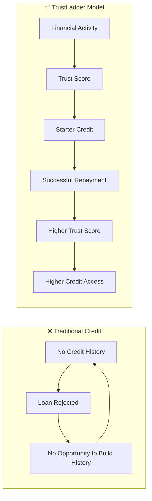

Instead of asking _"do you have history?"_, TrustLadder asks _"what does your behaviour tell us?"_

---

## 2. Technology Stack

| Layer | Technology |
|---|---|
| **Frontend** | React 18, TypeScript, Vite 5, Tailwind CSS 3 |
| **State / Routing** | React Router DOM 7, React Context |
| **Charts** | Recharts 3 |
| **Icons** | Lucide React |
| **Backend** | Django 4, Django REST Framework |
| **Auth** | SimpleJWT (access + refresh token pair) |
| **Auth Fallback** | Supabase (preview / offline environments) |
| **Database** | SQLite (development), PostgreSQL-ready |
| **Build Tool** | Vite |

---

## 3. System Architecture

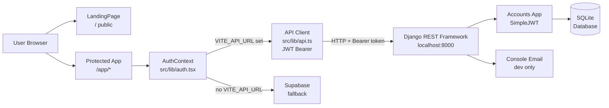

The application detects at runtime whether `VITE_API_URL` is configured. If it is, all authentication flows through Django. If not, Supabase handles sign-in for preview deployments.

---

## 4. Trust Score Engine

### Signal Weights

The Trust Score is a **transparent, rules-based weighted sum** of four signals:

| # | Signal | Weight | What It Measures |
|---|---|---|---|
| 01 | **Income Stability** | 30% | Earnings consistency, weekly variance, income trend, platform ratings |
| 02 | **Repayment Behaviour** | 25% | Past repayments, late/missed payments, BNPL behaviour, consistency |
| 03 | **Work Longevity** | 20% | Platform tenure, active months, work gaps, repeat customers |
| 04 | **Transaction Consistency** | 25% | Digital transaction frequency, recurring inflows, cash-flow patterns |

### Score Calculation Formula

```
TrustScore = (Income × 0.30) + (Repayment × 0.25) + (Longevity × 0.20) + (Transactions × 0.25)
```

**Example — Rahul Sharma (Established Worker):**

```
(82 × 0.30) + (90 × 0.25) + (70 × 0.20) + (85 × 0.25)
= 24.60 + 22.50 + 14.00 + 21.25
= 81.75  →  High Trust  →  Level 4
```

### Score Engine Data Flow

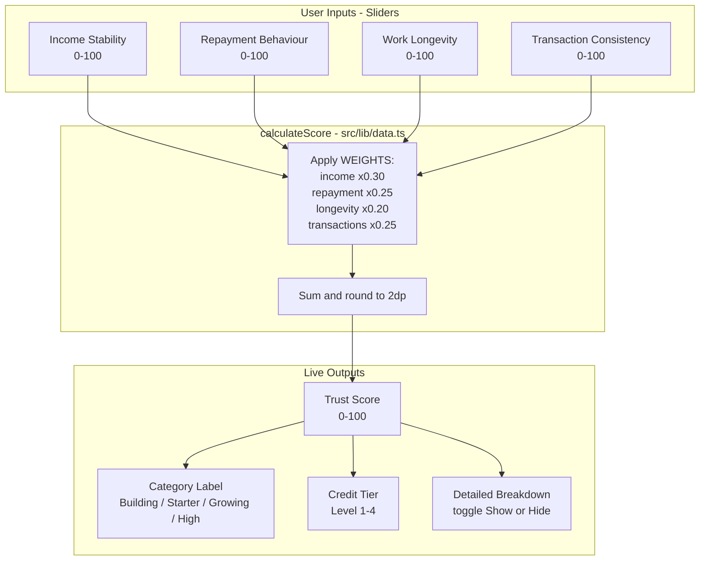

### Score-to-Category Mapping

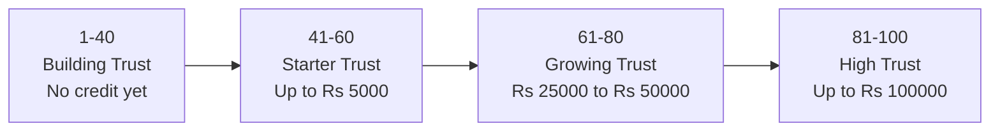

### Insufficient History

When a factor has no evaluable data (e.g. a user with no prior repayments), it is flagged `insufficient: true`. That factor is **excluded from the weighted calculation** rather than counting as zero — ensuring new-to-credit users are not penalised for lacking borrowing history.

---

## 5. Credit Ladder — Progressive Access

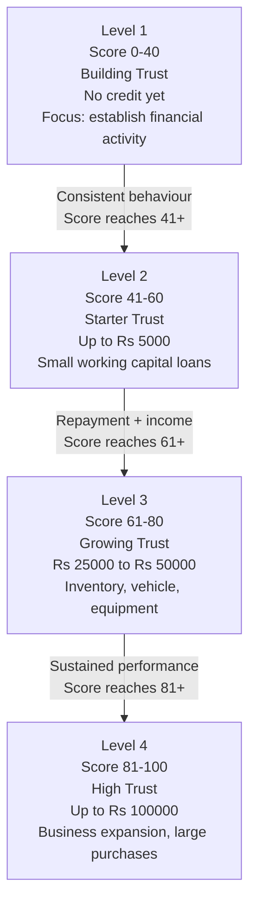

Access is **never binary** — every score improvement unlocks better products, creating a continuous positive loop.

---

## 6. Demo Personas

Three built-in demo personas showcase the full spectrum of the Trust Ladder:

| Persona | Occupation | Trust Score | Tier | Credit Available |
|---|---|---|---|---|
| **Priya Nair** | Delivery Partner | 47 | Level 2 | Up to ₹5,000 |
| **Amit Patel** | Small Vendor | 68 | Level 3 | ₹25,000–₹50,000 |
| **Rahul Sharma** | Delivery Partner | 81.75 | Level 4 | Up to ₹1,00,000 |

Each persona exposes the full dashboard including score breakdown, trend chart, improvement recommendations, and the score simulator.

---

## 7. Frontend Component Map

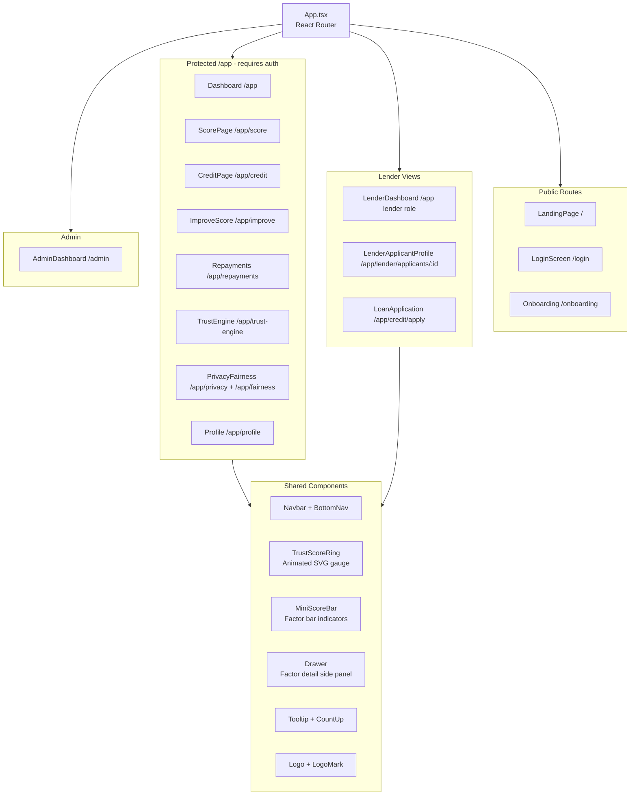

---

## 8. Authentication Workflow

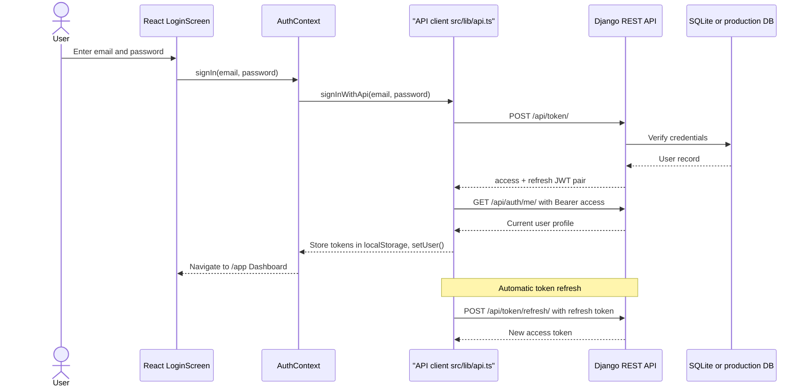

---

## 9. Request Workflow

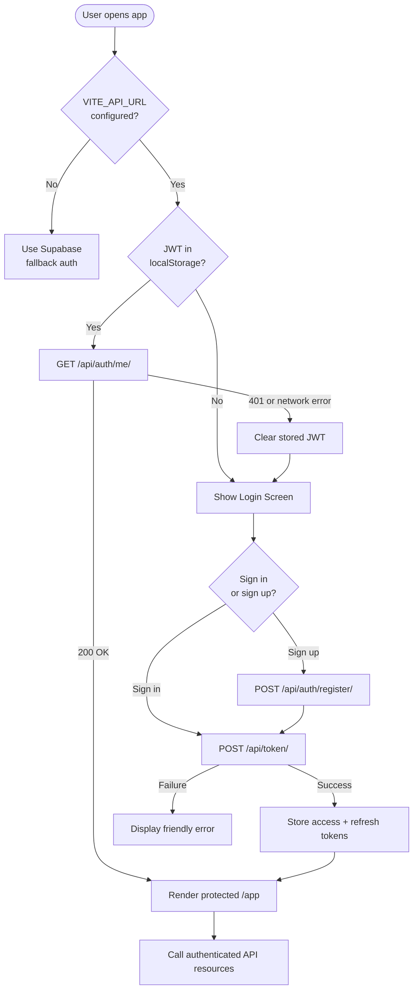

---

## 10. Database Schema

The current backend persists **user accounts only**. Trust scores, credit products, repayments, and personas live in `src/lib/data.ts` as demo data, ready for migration to Django models.

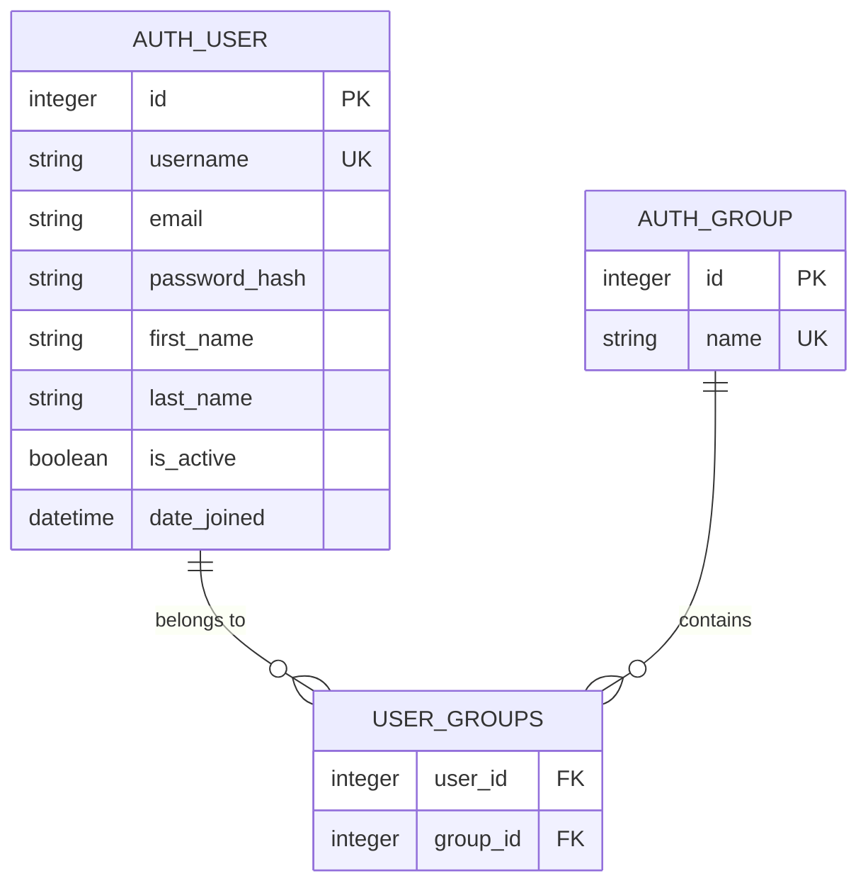

### Planned Future Schema

When product data moves to the backend, the following models should be added:

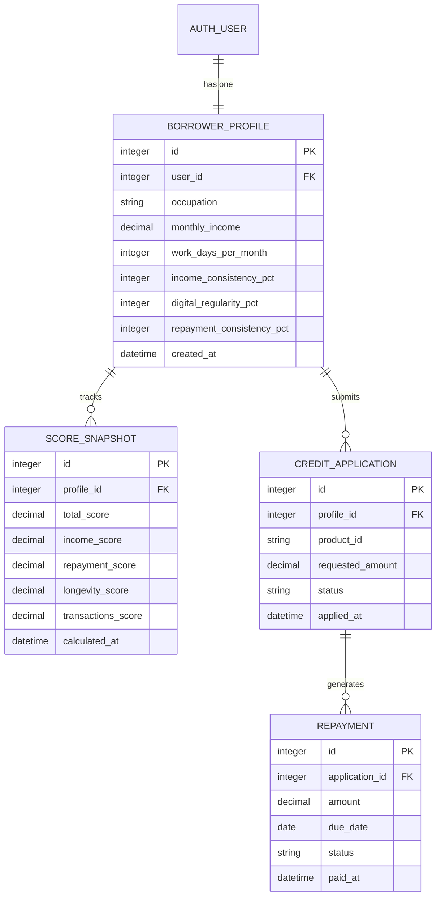

---

## 11. API Endpoints

| Method | Endpoint | Auth | Purpose |
|---|---|---|---|
| `POST` | `/api/auth/register/` | Public | Create a new user account |
| `POST` | `/api/token/` | Public | Obtain access + refresh JWT pair |
| `POST` | `/api/token/refresh/` | Public | Refresh an expired access token |
| `GET` | `/api/auth/me/` | Bearer JWT | Retrieve the current authenticated user |
| `POST` | `/api/auth/password-reset/` | Public | Request a password reset email |

> **Dev note:** Password reset emails use Django's console email backend during development — the reset link is printed directly in the backend terminal output.

---

## 12. Accessibility & Usability Standards

TrustLadder has been audited and refactored to meet **WCAG AA** compliance and modern usability heuristics.

### Heading Hierarchy

All pages follow a strict `h1 → h2` heading outline with no skipped levels, ensuring screen readers can navigate content correctly.

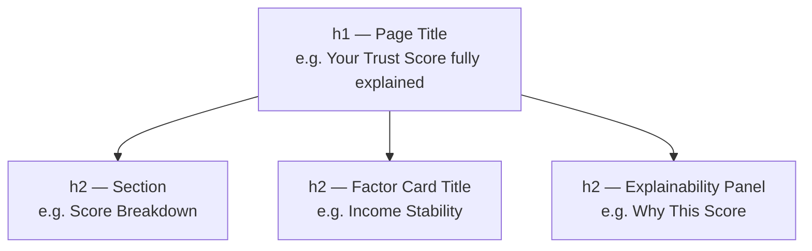

### Typography — Minimum Font Sizes

All body text is rendered at **minimum 12px (`text-xs`)** to meet legibility guidelines on mobile and desktop. Sub-12px sizes (`text-[11px]`) have been fully eliminated.

| Element | Before | After |
|---|---|---|
| Card badges / labels | `text-[11px]` 11px | `text-xs` 12px |
| Trend indicators | `text-[11px]` 11px | `text-xs` 12px |
| Hero status badge | `text-[11px]` 11px | `text-xs` 12px |
| Score category tags | `text-[11px]` 11px | `text-xs` 12px |
| Footer copyright | `text-[11px]` 11px | `text-xs` 12px |
| Factor descriptions | `text-[11px]` 11px | `text-xs` 12px |

### Interactive Element Affordance

| Element | Before | After | Reason |
|---|---|---|---|
| Range slider track height | 4px | 8px | Distinguishes interactive from static progress bars |
| Secondary CTA Play icon | `h-3.5 w-3.5` outline | `h-4 w-4 fill-current` | Increases visual weight |
| Secondary CTA border | `border-white/10` | `border-white/20 hover:border-white/40` | Improves visibility vs primary CTA |

### Nested Interactive Triggers — Persona Cards

Previously, persona cards were `<button>` elements containing an inner "Launch demo" label. This created ambiguous interaction patterns. Refactored to a clear single trigger:

```html
<!-- Before: ambiguous nested button -->
<button class="panel ...">
  ...card content...
  <div>Launch demo →</div>   <!-- looks interactive but isn't -->
</button>

<!-- After: clear single trigger -->
<div class="panel ...">
  ...card content...
  <button aria-label="Launch demo for Rahul Sharma">
    Launch demo →
  </button>
</div>
```

### Section Label Prefix Consistency

All code-style section headers now consistently use the `// ` prefix:

| Before | After |
|---|---|
| `## how_it_works` | `// how_it_works` |
| `## score_calculator` | `// score_calculator` |
| `fairness_by_design` | `// fairness_by_design` |
| `traditional_credit` | `// Traditional Credit` |

### Cognitive Load — Score Calculator

The detailed mathematical breakdown (`82 × 30% = 24.60`) is hidden behind a **"Show detailed calculation"** toggle by default, reducing visual density for users who only want to see the live score.

---

## 13. Design System — Color & Typography Tokens

### Colour Palette

| Role | Tailwind Token | Usage |
|---|---|---|
| **Primary text** | `text-white` | Headings, scores, key values |
| **Secondary text** | `text-gray-300` | Body copy, descriptions |
| **Muted text** | `text-gray-400` | Labels, metadata, hints |
| **Subtle text** | `text-gray-500` | Ordinal numbers, dim icons |
| **Accent — Blue** | `text-blue-glow` | Primary actions, weights, active nav |
| **Accent — Emerald** | `text-emerald-glow` | Positive trends, high trust, success |
| **Accent — Amber** | `text-amber` | Attention states, improvement flags |
| **Accent — Violet** | `text-violet-glow` | ML / AI references, future features |
| **Danger** | `text-red` | Reserved for errors only |

### Background Surfaces

| Surface | Token | Description |
|---|---|---|
| App background | `bg-ink-900` | Near-black base |
| Card surface | `bg-ink-850` | Panel background |
| Elevated surface | `bg-ink-800` | Inputs, drawers |

### Typography Scale

| Token | Size | Weight | Usage |
|---|---|---|---|
| `text-5xl font-bold` | 48px | 700 | Score ring large number |
| `text-3xl font-semibold` | 30px | 600 | Section headings |
| `text-2xl font-semibold` | 24px | 600 | h2 section titles |
| `text-xl font-semibold` | 20px | 600 | Page h1 greetings |
| `text-lg font-semibold` | 18px | 600 | Panel headings |
| `text-base font-semibold` | 16px | 600 | Sub-headings |
| `text-sm` | 14px | 400 | Standard body copy |
| `text-xs` | 12px | 400 | Labels, badges, captions **(minimum allowed)** |

---

## 14. Project Structure

```text
project/
├── src/
│   ├── App.tsx                        Root router and protected route guards
│   ├── main.tsx                       Vite entry point
│   ├── index.css                      Global styles, Tailwind layers, design tokens
│   ├── types.ts                       Shared TypeScript types
│   │
│   ├── lib/
│   │   ├── api.ts                     Django JWT API client (login, register, me, refresh)
│   │   ├── auth.tsx                   AuthContext provider (persona, role, demo mode)
│   │   └── data.ts                    Score engine (WEIGHTS, calculateScore), personas, mock data
│   │
│   ├── components/
│   │   ├── Navbar.tsx                 Sticky top nav, bottom mobile nav, role switcher, notifications
│   │   ├── TrustScoreRing.tsx         Animated SVG score gauge + MiniScoreBar
│   │   ├── Drawer.tsx                 Side panel for factor detail
│   │   ├── Tooltip.tsx                Tooltip wrapper + CountUp animated number
│   │   └── Logo.tsx                   Logo wordmark + LogoMark icon
│   │
│   └── pages/
│       ├── LandingPage.tsx            Public page: calculator, personas, ladder, fairness
│       ├── LoginScreen.tsx            Sign in / sign up / password reset
│       ├── Onboarding.tsx             3-step data connection onboarding
│       ├── Dashboard.tsx              Borrower home: score ring, trend, health, breakdown
│       ├── ScorePage.tsx              Full score explanation with factor drawer
│       ├── CreditPage.tsx             Credit product listings and eligibility
│       ├── ImproveScore.tsx           Improvement recommendations + what-if simulator
│       ├── Repayments.tsx             Repayment schedule and history
│       ├── TrustEngine.tsx            Transparency page: current vs future model
│       ├── PrivacyFairness.tsx        Privacy controls + fairness disclosure
│       ├── Profile.tsx                User profile and connected data sources
│       ├── LenderDashboard.tsx        Lender workspace: applicant list and stats
│       ├── LenderApplicantProfile.tsx Lender view of individual borrower
│       ├── LoanApplication.tsx        Credit application form and repayment preview
│       └── AdminDashboard.tsx         Admin analytics: score distribution, performance
│
├── backend/
│   ├── manage.py                      Django management entry point
│   ├── config/
│   │   ├── settings.py                Django settings (CORS, JWT, email, DB)
│   │   └── urls.py                    Root URL configuration
│   └── accounts/
│       ├── serializers.py             DRF serializers for registration and profile
│       ├── views.py                   register, me, password_reset endpoints
│       └── urls.py                    /api/auth/* URL patterns
│
├── .env.example                       Environment variable template
├── tailwind.config.js                 Custom colors, fonts, animations
├── vite.config.ts                     Vite path aliases and plugins
├── tsconfig.app.json                  TypeScript compiler config
└── package.json                       npm scripts: dev, build, lint, typecheck
```

---

## 15. Setup & Running Locally

### Requirements

- Node.js 18+
- Python 3.10+

### Frontend Setup

```powershell
# From project root
npm install
Copy-Item .env.example .env
```

Edit `.env` to point to your Django backend:

```env
VITE_API_URL=http://localhost:8000
```

### Backend Setup

```powershell
Set-Location backend
python -m venv .venv
.\.venv\Scripts\Activate.ps1
python -m pip install -r requirements.txt
python manage.py migrate
```

> If PowerShell blocks activation, call Python directly:
> `backend\.venv\Scripts\python.exe manage.py migrate`

### Running Both Servers

Open two terminals from the project root.

**Terminal 1 — Backend:**
```powershell
Set-Location backend
.\.venv\Scripts\Activate.ps1
python manage.py runserver 8000
```

**Terminal 2 — Frontend:**
```powershell
npm run dev
```

| Server | URL |
|---|---|
| Frontend (Vite) | `http://localhost:5173/` |
| Backend (Django) | `http://localhost:8000/` |

---

## 16. Useful Commands

**Frontend:**

```powershell
npm run dev          # Start Vite dev server with HMR
npm run build        # Production bundle
npm run typecheck    # TypeScript type validation (no emit)
npm run lint         # ESLint across all source files
npm run preview      # Preview the production build locally
```

**Backend:**

```powershell
Set-Location backend
.\.venv\Scripts\python.exe manage.py check            # Validate Django config
.\.venv\Scripts\python.exe manage.py migrate          # Apply DB migrations
.\.venv\Scripts\python.exe manage.py createsuperuser  # Create admin user
.\.venv\Scripts\python.exe manage.py shell            # Interactive Django shell
```

---

## 17. Production Notes

Before deploying to production:

| Item | Action Required |
|---|---|
| `SECRET_KEY` | Replace with a long random secret — never commit it |
| `DEBUG` | Set to `False` |
| `ALLOWED_HOSTS` | Add your production domain(s) |
| CORS origins | Configure `CORS_ALLOWED_ORIGINS` for the frontend domain |
| Database | Switch from SQLite to PostgreSQL or MySQL |
| Email backend | Configure SMTP (SendGrid, SES, Postmark, etc.) |
| Static files | Run `collectstatic` and serve via Nginx or CDN |
| WSGI / ASGI | Deploy via Gunicorn + Nginx or Uvicorn |
| HTTPS | Enforce HTTPS; set `SECURE_SSL_REDIRECT = True` |
| JWT secrets | Rotate `SIGNING_KEY` in SimpleJWT settings |
